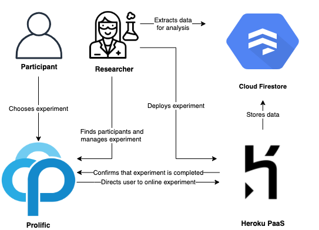
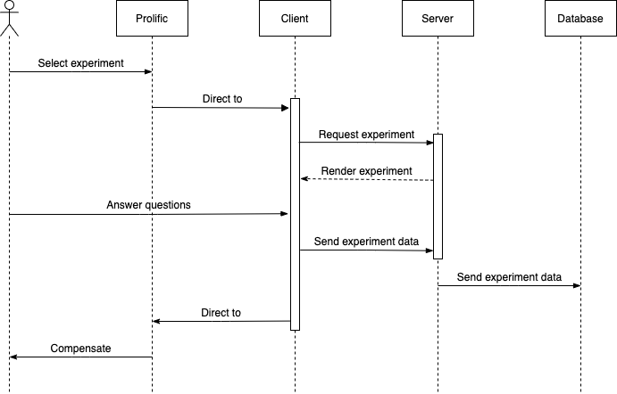

# Architecture

!!! Note "Note to myself"
    - What do new developer need to know?
        - Architecture
        - Main technologies
        - GitHub
    - What should lab members know when I am gone?
        - Documentation should be clear enough that I am not contacted for help once I leave.
    - Coding components
        - jsPsych library + plugin
        - Experiment class
        - Timeline
        - Graph generation

## Flow Diagram

## Experiment Application Architecture

Experiments are displayed on the browser (client) with a URL created by Heroku (<a href="https://vcl-web.herokuapp.com" target="_blank">https://vcl-web.herokuapp.com</a>).

## Sequence Diagram

