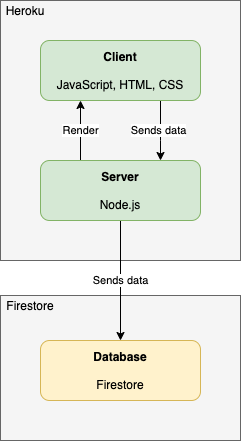

# Architecture

!!! Note "Note to myself"
    - What do new developer need to know?
        - Architecture
        - Main technologies
        - GitHub
    - What should lab members know when I am gone?
        - Documentation should be clear enough that I am not contacted for help once I leave.
    - Coding components
        - jsPsych library + plugin
        - Experiment class
        - Timeline
        - Graph generation

## Flow Diagram

Due to the COVID-19 pandemic, our team felt increasing urgency in implementing a version of the framework that was ready for running experiments online. We ended up deploying online with Heroku with Cloud Firestore as the database, and Prolific for the participant hub. This required major feature changes such as routing, resolution scaling, screening tasks. 

[Detailed documentation](https://docs.google.com/document/d/1221pq6_ehmMGN0F6CGLEhbQOaf9zoMEsmH3cXxXPJgs/edit?usp=sharing)

## Experiment Application Architecture

Experiments are displayed on the browser (client) with a URL created by Heroku (<a href="https://vcl-web.herokuapp.com" target="_blank">https://vcl-web.herokuapp.com</a>).

## Sequence Diagram

